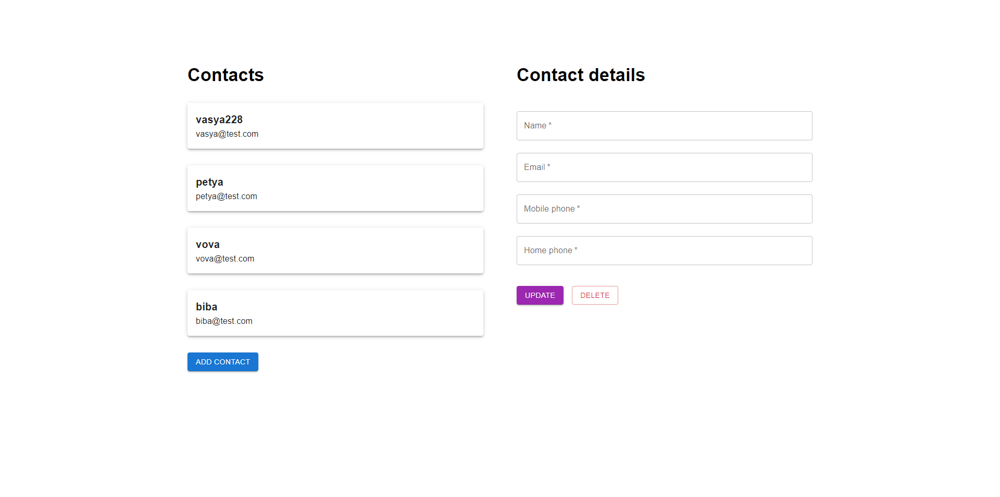
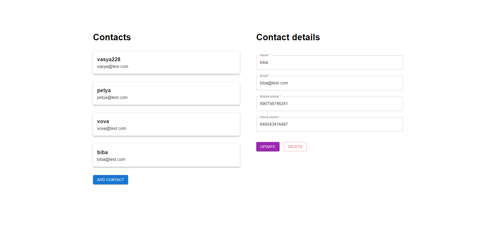
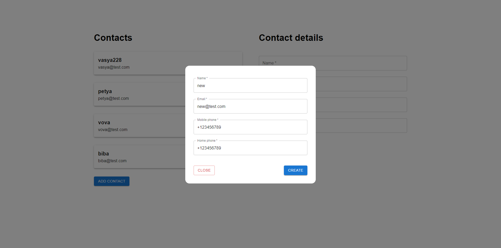

# next-phone-contacts

## Quick Start

1. Install dependencies:

```bash
npm i
# or
yarn
```

2. Run dev server:

```bash
npm run dev
# or
yarn dev
```

3. All CRUD operations are available using following endpoints:

   - `api/contacts` - GET and POST methods
   - `api/contacts/{id}` - PUT and DELETE methods

Open [http://localhost:3000](http://localhost:3000) with your browser to see the result.

## Images






