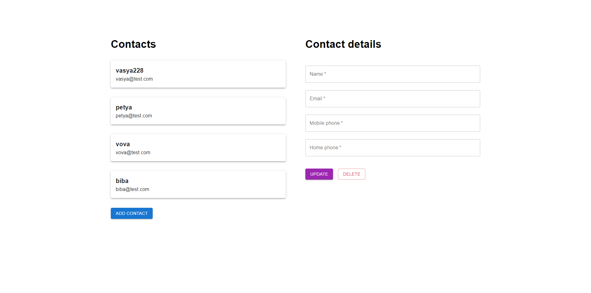
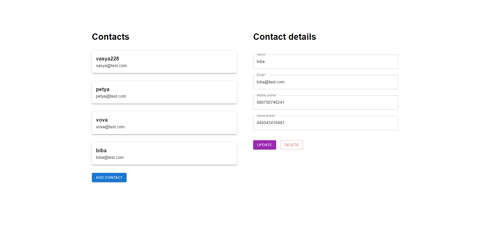
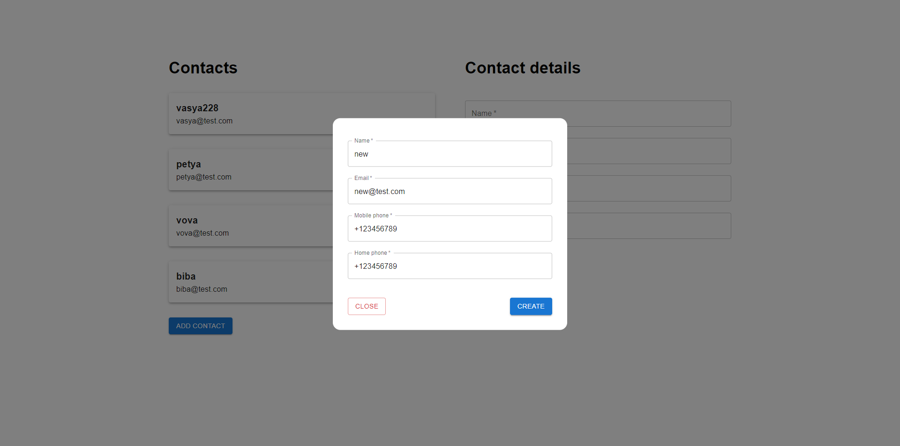
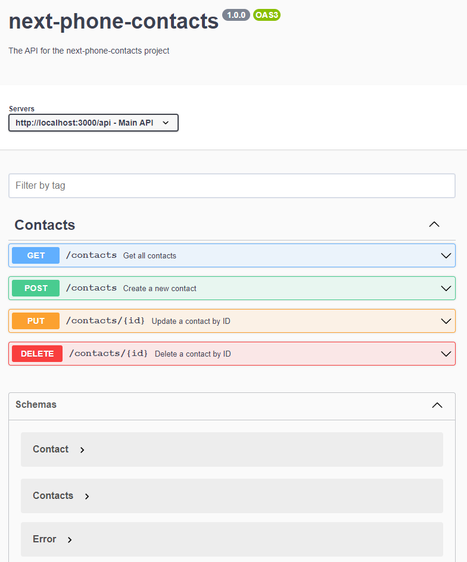

# next-phone-contacts

## Quick Start

1. Install dependencies:

```bash
npm i
# or
yarn
```

2. Create `.env` file (read more in Prisma ORM documentation):

```bash
DATABASE_URL="your:path/to/db"
```

3. Run dev server:

```bash
npm run dev
# or
yarn dev
```

All CRUD operations are available using following endpoints:

- `api/contacts` - GET and POST methods
- `api/contacts/{id}` - PUT and DELETE methods

Open [http://localhost:3000](http://localhost:3000) with your browser to see the result.

## Images

Some preview images.







## Swagger

You can read a Swagger API documentation in `docs/swagger.yaml` ([go to file](docs/swagger.yaml)).


